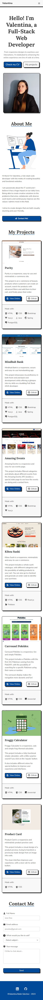

# My Portfolio

## Table of contents

- [Overview](#overview)
  - [Screenshots](#screenshots)
  - [Live Site](#live-site)
- [My process](#my-process)
  - [Built with](#built-with)
  - [Useful resources](#useful-resources)
- [Author](#author)

## Overview

### Screenshots

### Live Site

- Live Site URL: [My Portfolio](https://portfolio-valentina-sanchez.vercel.app/)

## My process

### Built with

- Semantic HTML5 markup
- CSS3
- Bootstrap
- [Animate.css](https://animate.style/) - for small animations
- Mobile-first workflow
- [React + Vite](https://vitejs.dev/)
- [React Icons](https://react-icons.github.io/react-icons/)
- [EmailJS](https://www.emailjs.com/) - for the contact form
- [i18next](https://www.i18next.com/) - for translations

### Useful resources

- [i18next video tutorial](https://www.youtube.com/watch?v=OfJ6Q-JFLL0) - This is an amazing video which helped me to understand the usage of i18next better. 

## Author

- Linkedin - [Valentina Belén Sánchez](https://www.linkedin.com/in/valentina-belen-sanchez/)
- Github - [@ValentinaBS](https://github.com/ValentinaBS)

---

# Mi Portfolio

## Tabla de contenidos

- [Descripción general](#descripción-general)
  - [Capturas de pantalla](#capturas-de-pantalla)
  - [Sitio Web](#sitio-web)
- [Mi proceso](#mi-proceso)
  - [Desarrollado con](#desarrollado-con)
  - [Recursos útiles](#recursos-útiles)
- [Autora](#autora)

## Descripción general

### Capturas de pantalla

### Sitio Web

- URL del sitio: [Mi Portfolio](https://portfolio-valentina-sanchez.vercel.app/)

## Mi proceso

### Desarrollado con

- HTML5 semántico
- CSS3
- Bootstrap
- [Animate.css](https://animate.style/) - para pequeñas animaciones
- Flujo de trabajo mobile-first
- [React + Vite](https://vitejs.dev/)
- [React Icons](https://react-icons.github.io/react-icons/)
- [EmailJS](https://www.emailjs.com/) - para el formulario de contacto
- [i18next](https://www.i18next.com/) - para traducciones

### Recursos útiles

- [Tutorial en video de i18next](https://www.youtube.com/watch?v=OfJ6Q-JFLL0) - Este es un video muy útil que me ayudó a entender mejor el uso de i18next.

## Autora

- Linkedin - [Valentina Belén Sánchez](https://www.linkedin.com/in/valentina-belen-sanchez/)
- Github - [@ValentinaBS](https://github.com/ValentinaBS)